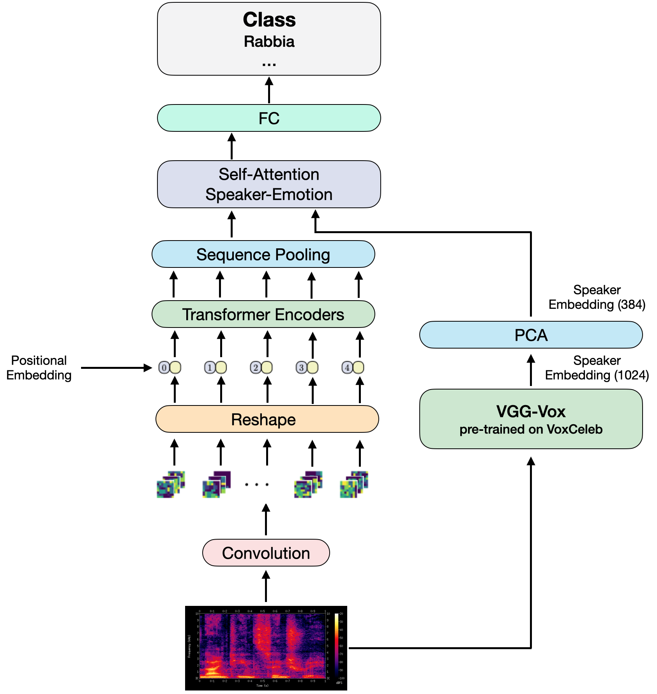
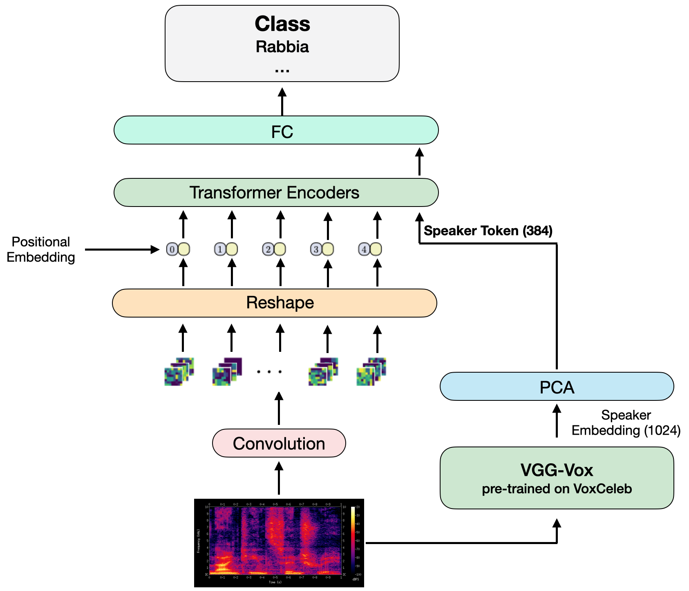

# SPEAKER VGG CCT: speech emotion recognition basata su speaker embeddings e Vision Transformers

Questo progetto è stato realizzato come progetto di tesi per il corso di laurea magistrale in ingegneria informatica 
dell'Università degli Studi di Firenze.

Il lavoro si pone come particolarmente innovativo dato che risulta essere il primo tentativo di applicare una variante dei 
Vision Transformers (ViT) alla Speech Emotion Recognition (SER).
Nello specifico, se ne prevede l'utilizzo dei Compact Convolutional Transformers (CCT), i quali 
rappresentano una variante dei comuni ViT capace di ottenere delle performance superiori delle reti convoluzionali
per la classificazione d'immagini anche quando preaddestrati su pochi dati.

# Modelli implementati

Il progetto estende l'implementazione pubblicata all'interno della repository [Compact-Transformers](https://github.com/SHI-Labs/Compact-Transformers).<br/>
Perciò, tutti i modelli definiti in [Variants.md](Variants.md) sono utilizzabili anche in questo progetto.

In aggiunta si sono poi implementate anche delle architetture basate sull'estrazione di speaker embedding:

<table style="width:100%">
    <thead>
        <tr>
            <td><b>Model</b></td>
            <td><b>Resolution</b></td>
            <td><b>PE</b></td>
            <td><b>Name</b></td>
            <td><b>Pretrained Weights</b></td>
            <td><b>Config</b></td>
        </tr>
    </thead>
    <tbody>
        <tr>
            <td rowspan=1>SPEAKER VGG CCT</td>
            <td>224x224</td>
            <td>Learnable</td>
            <td><code>speaker_vgg_cct_14_7x2_224</code></td>
            <td>ImageNet-1k/300 Epochs</td>
            <td><code>pretrained/cct_14-7x2_imagenet.yml</code></td>
        </tr>
        <tr>
            <td rowspan=1>SPEAKER VGG CCT END TO END</td>
            <td rowspan=1>224x224</td>
            <td>Learnable</td>
            <td><code>speaker_vgg_cct_end_to_end_14_7x2_224</code></td>
            <td>ImageNet-1k/300 Epochs</td>
            <td><code>pretrained/cct_14-7x2_imagenet.yml</code></td>
        </tr>
        <tr>
            <td rowspan=1>SPEAKER VGG CCT END TO END SPEAKER TOKEN</td>
            <td rowspan=1>224x224</td>
            <td>Learnable</td>
            <td><code>speaker_vgg_cct_end_to_end_speaker_token_14_7x2_224</code></td>
            <td>ImageNet-1k/300 Epochs</td>
            <td><code>pretrained/cct_14-7x2_imagenet.yml</code></td>
        </tr>
    </tbody>
</table>


## Architetture proposte
### CCT in SER
L'obiettivo del lavoro è stato quello di proporre dei nuovi metodi basati sull'applicazione
dei CCT al problema della Speech Emotion Recognition.<br/>
Per farlo si è utilizzata la comune pipeline considerata come lo stato dell'arte per la SER real-time.
Questa prevede di estrarre dai segnali audio i loro spettrogrammi, trasformarli in un'immagine e
poi utilizzare una rete convoluzionale per discriminare l'emozione.<br/>
In questa implementazione si fa riferimento alla stessa procedura ma con la differenza che si
utilizza un CCT per classificare (scegliendo la specifica architettura tra quelle riportate in [Variants.md](Variants.md)).


### SPEAKER VGG CCT
La semplice architettura dei CCT è stata estesa per SER con la definizione di un modello facente uso di speaker embedding
come rappresentazione della voce associata agli speaker. <br/>
Nello specifico il modello utilizza un modulo di self-attention per rilevare la dipendenza tra lo 
speaker embedding e l'emozione (le features estratte dallo spettrogramma con il CCT). <br/>
Per il lavoro di tesi come speaker embedder si è utilizzata una rete disponibile in letteratura nota
come VGG-Vox.
<div align="center">

</div>


### SPEAKER VGG CCT END TO END
In questa architettura si sfrutta il fatto che il modulo di self-attention è già integrato negli encoders dei 
CCT per definire un modello end-to-end in cui cioè lo speaker embedding viene dato in input direttamente al blocco
Transformer Encoder.<br/>
La dipendenza tra speaker ed emozione viene quindi appresa direttamente all'interno del modello
anzichè in un modulo a se stante.
<div align="center">

</div>

### SPEAKER VGG END TO END SPEAKER TOKEN
Metodo identico al precedente ma con la differenza che anzichè utilizzare un Sequence Pooling, si utilizza
direttamente l'output del Transformer Encoder corrispondente allo speaker token per classificare.
<div align="center">

</div>

# Come utilizzare i modelli

Per addestrare ed utilizzare le architetture all'interno del proprio codice, è sufficiente importarli 
e farvi riferimento con il campo **Name** associatovi nella tabella dei modelli. <br/>
Ad esempio:

```python3
from models import speaker_vgg_cct_14_7x2_224

model = speaker_vgg_cct_14_7x2_224(pretrained=True, progress=True)
```

## Note
I modelli CCT ricevono in input un solo valore che rappresenta il tensore dell'immagine (spettrogramma)
da classificare.<br/>
Le architetture che invece utilizzano gli speaker embedding ricevono una tupla del tipo (A, B) dove A 
è il tensore associato allo spettrogramma e B è quello che rappresenta lo speaker embedding del campione. <br/>

**!!!!** Si noti che lo speaker embedding deve avere la stessa dimensione interna del CCT in uso, dove questo
parametro è configurabile in fase di definizione con il nome di *embedding_dim*. Per i modelli con speaker 
embedding riportati in tabella questo valore è pari a 384 e quindi tale dovrà essere la lunghezza
degli speaker embedding.

# Citation
```bibtex
@article{vox_celeb,
  title={VoxCeleb: a large-scale speaker identification dataset},
  author={Arsha Nagrani, Joon Son Chung, Andrew Zisserman},
  year={2018},
}
```